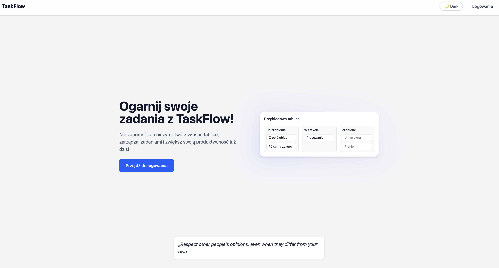
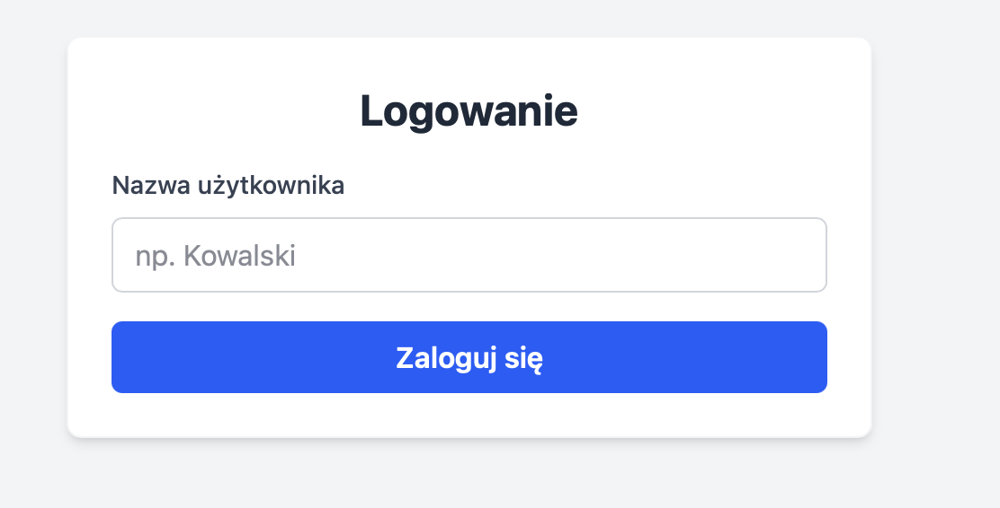
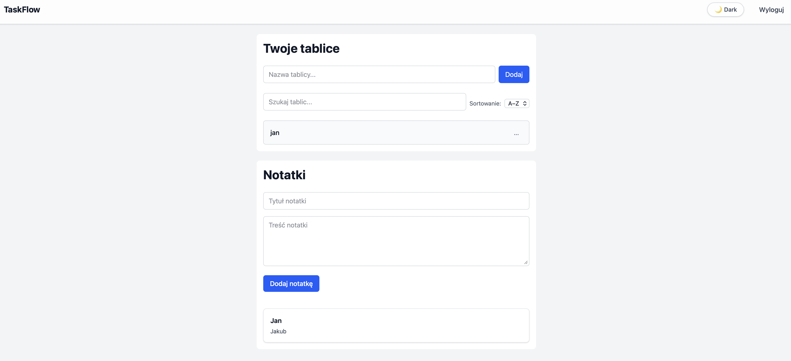
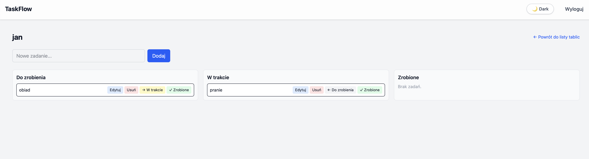

## TaskFlow - Task Manager
```
TaskFlow to prosta aplikacja typu Kanban, umożliwiająca zarządzanie zadaniami poprzez podział na kolumny Do zrobienia, W trakcie oraz Zrobione. Aplikacja została zbudowana w React z użyciem TypeScript oraz Tailwind CSS.for Fast Refresh
```

🔗 Live demo: https://taskflow-livid-xi.vercel.app

## 💫 Funkcjonalność
```
- Dodawanie nowych zadania
- Edycja istniejących
- Usuwanie zadań
- Zmiana statusu zadania (do zrobienia, w trakcie, zrobione)
- Logowanie użytkownika
- Protected routes
- Dark mode
- Responsywność
```
## ⚙️ Instalacja i uruchomienie
1. Sklonuj repozytorium
```
https://github.com/mnianek/TaskFlow.git
```
2. Przejdź do katalogu
```
cd TaskFlow
```
3. Instalacja zależności
```
npm install
```
4. Uruchomienie projektu
```
npm run dev
```
5. Otwórz w przeglądarce (http://localhost:5173)

## Konfiguracja
```
Projekt nie wypaga kluczy API do uruchomienia lokalnego. Autoryzaja jest realizowana po stronie frontendu.
```
## 📸 Screenshoty

### Strona główna


### Logowanie


### Po zalogowaniu


### Zadania


## Struktura projektu
```
src/
├── components/                
│   ├── Navigation.tsx      # Górna nawigacja aplikacji    
│   ├── NoteForm.tsx        # Formularz i dodawanie notatki
│   ├── Notes.tsx           # Lista notatek
│   └── Quote.tsx           # Komponent wyświetlający cytt
│ 
├── pages/                
│   ├── BoardDetails.tsx    # Szczegóły tablicy i zarządzanie zadaniami
│   ├── Boards.tsx          # Widok listy tablic
│   ├── Home.tsx            # Strona główna aplikacji
│   └── Login.tsx           # Strona logowania 
│ 
├── routes/                    
│   ├── ProtectedRoute.tsx  # Blokuje wejście do /boards dla niezalogowanych użytkowników
│   └── UserRoute.tsx       # Blokuje wrócenie do home po zalogowaniu
│
├── App.tsx                 # Główny komponent aplikacji
└── index.css               # Konfiguracja Tailwind CSS

```
## Lista użytych bibliotek

	•	React - komponenty
	•	TypeScript - typowanie
	•	React Router DOM - obsługa routingu i zabezpieczonych tras
	•	Tailwind CSS - framework CSS
	

## Known Issues

- Brak backendu - dane nie są trwałe po odświeżeniu
- Autoryzacja ma charakter demonstracyjny

## Diagram architektury
```
App
 ├── Navigation
 └── Routes
      ├── UserRoute
      │    ├── Home
      │    │    └── Quote
      │    └── Login
      │
      └── ProtectedRoute
           └── BoardDetails
              ├── Notes
               └── NoteForm
```
## Opis kluczowych elementów 

### BoardDetails.tsx
- Główny widok tablicy.
- Wyświetla zadania w kolumnach (Do zrobienia, W trakcie, Zrobione)
- Zarządzanie stanem zadań
- Obsługuje akcję użytkownika (dodawanie, edycja, usuwanie, zmiana statusu)
### Notes.tsx
- Renderowanie listy notatek z API

### NoteForm.tsx

- Dodawanie nowych notatek do API

### Navigation.tsx

- Górna nawigacja aplikacji
- Poruszanie się pomiędzy widokami
- Wyświetlanie opcji zależnych od stanu zalogowania użytkownika

### ProtectedRoute.tsx

- Sprawdza, czy użytkownik jest zalogowany
- Blokuje dostęp do /boards dla niezalogowanych,
- Przekierowuje użytkownika do strony logowania w przypadku braku autoryzacji

### UserRoute.tsx

- Zapobiega powróceniu na strone główną

## Opis co sprawiło problem i jak go rozwiązałem

Problem: Vercer nie deployował aplikacji z powodu "unverifed commits"

Rozwiązanie: Wyłączyłem opcję Verifed Commits w ustawieniach projektu Vercel

## Future Improvements

- Drag & Drop
- Integracja z backendem 
- Zapisywanie danych użytkownika

## Dokumentacja API

## Component Documentation

Poniżej przedstawiono dokumentację najważniejszych komponentów aplikacji TaskFlow.

### Navigation
Opis: Górny pasek nawigacji aplikacji. Umożliwia poruszanie się pomiędzy widokami oraz wylogowanie użytkownika.

### BoardDetails

Opis: Główny komponent widoku tablic.

### Notes

Opis: Komponent odpowiedzialny za wyświetlanie notatek.

### NoteForm

Opis: Formularz dodawania notatek

### ProtectedRoute

Opis: Komponent zabezpieczający dostęp do wybranych tras aplikacji.

### UserRoute

Opis: Komponent blokujący dostęp do home po zalogowaniu.

### Quote

Opis: Komponent UI wyświetlający losowy cytat na stronie głównej.


## ADR

### ADR-001: Wybór architektury frontendowej

Status: Accepted

### Kontekst

Celem projektu TaskFlow było stworzenie prostej aplikacji do zarządzania zadaniami.

### Decyzje
- React – komponentowa architektura UI
	- TypeScript - typowanie i mniejsza liczba błędów
	•	Tailwind CSS – szybkie i spójne stylowanie


## Contribution Guide

Projekt TaskFlow jest otwarty na rozwój i rozbudowę. Poniżej opisano podstawowe zasady dodawania nowych funkcjonalności.

1. Utwórz fork repozytorium na swoim koncie GitHub.
2. Klonowanie projektu 
```
git clone https://github.com/twoj-login/TaskFlow.git
cd TaskFlow
```
3. Utworzenie nowego brancha 
```
git checkout -b feature/nazwa-funkcji
```
4. Zasady pisania kodu
- stosuj czytelne nazwy komponentów i zmiennych
- spójną strukturę projektu
- używaj TypeScript do definiowania typów
- dbaj o czytelność komponentów React
5. Commitowanie zmian
```
git commit -m "Add drag and drop to task board"
```
6. Push i Pull Request
```
git push origin feature/nazwa-funkcji
```
## Video Demo

Link do filmu na YouTube: https://youtu.be/pFyuThSfRIY


